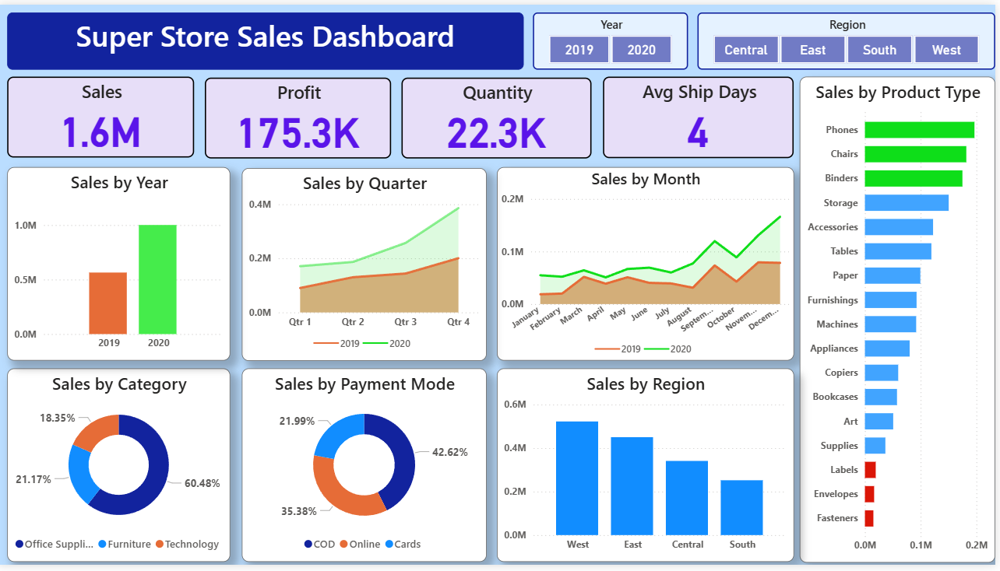

#  Sales Performance Dashboard – Syntecxhub Project

##  Project Overview
This project is a **Sales Performance Dashboard** developed as part of a Data Analytics training program at Syntecxhub.  
The dashboard provides insights into sales performance, profit analysis, and business trends across different categories and regions.

---

##  Objectives
- Analyze overall sales and profit performance  
- Compare yearly performance (2019 vs 2020)  
- Identify top-performing and low-performing products  
- Understand regional and category-wise trends  
- Track business performance using interactive visuals  

---

##  Tools & Technologies
- Power BI  
- DAX (Data Analysis Expressions)  
- Data Visualization Techniques  

---

##  Insights
- December recorded the highest monthly sales, suggesting strong year-end demand.
- The West region contributed the highest sales.
- Office Supplies was the most purchased category.
- The Phones category recorded the highest sales.
- Cash on Delivery (COD) was the most used payment method.  

---

##  Dashboard Preview

